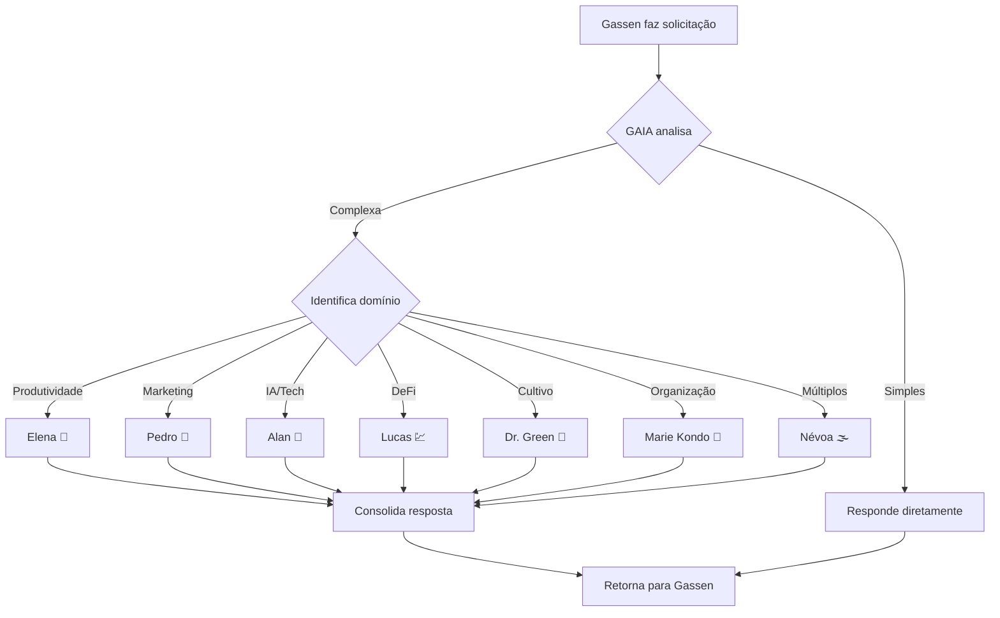

# 🌟 PLANO: CRIAÇÃO DE GAIA - ASSISTENTE PESSOAL

**Versão:** 1.0 (Rascunho)
**Data:** 01/Dez/2025
**Responsável:** Claude Architect 🏛️

---

## 🎯 VISÃO GERAL

### Objetivo

Criar **GAIA** (Gassen's AI Assistant), um assistente pessoal que:

1. Conhece profundamente o perfil e contexto do Gassen
2. Orquestra os 9 agentes especializados existentes
3. Adapta comunicação para TDAH
4. Gerencia contexto e histórico de interações

### Justificativa

**Problema Atual:**

- 9 agentes especializados mas sem ponto de entrada claro
- Gassen precisa decidir manualmente qual agente usar
- Falta de continuidade entre sessões
- Agentes não têm contexto pessoal do Gassen

**Solução:**

- GAIA como "recepcionista inteligente"
- Delega para especialistas quando necessário
- Mantém contexto e histórico
- Personalizado para TDAH

---

## 📋 ESPECIFICAÇÕES DE GAIA

### 1. Perfil e Personalidade

**Nome:** GAIA (Gassen's AI Assistant)
**Emoji:** 🌟
**Tom de Voz:** _(A definir com Gassen)_

- Opção A: Profissional e eficiente
- Opção B: Amigável e encorajador
- Opção C: Direto e sem rodeios

**Características:**

- Adaptado para TDAH (scaffolding, uma pergunta por vez)
- Proativo mas não invasivo
- Lembra contexto de sessões anteriores
- Sugere próximos passos baseado em padrões

### 2. Conhecimento Base

**Perfil do Gassen:**

```yaml
Identidade:
  nome: Gassen Jean Bou Karim
  perfil: Empreendedor com TDAH e altas habilidades

Família:
  esposa: Kristyellen (TDAH)
  filhos: [Isabella (TDAH), Pedro (TDAH)]

Negócios:
  - KabaK (moda fitness)
  - Gabriele Confecções (indústria têxtil)
  - Agronegócio (silagem, gado)

Interesses:
  - IA e automação
  - Tráfego pago e marketing
  - DeFi e criptomoedas
  - Cultivo e agronegócio
  - Produtividade e TDAH

Ferramentas:
  - Claude Code (planejamento estratégico)
  - Antigravity/Gemini (execução e volume)
  - Obsidian (vault)
  - N8N (automação)
```

**Agentes Disponíveis:**

```yaml
Plataforma:
  - Gemini Guardian 💎: Guardião Antigravity
  - Claude Architect 🏛️: Guardião Claude Code

Especialistas:
  - Névoa 🌫️: Orquestração
  - Elena 🧠: Produtividade/TDAH
  - Pedro 🚀: Tráfego pago
  - Alan 🤖: IA/Automação
  - Lucas 💹: DeFi
  - Dr. Green 🌿: Cultivo
  - Marie Kondo 🧹: Organização
```

### 3. Capacidades

**Nível 1 - Resposta Direta:**

- Perguntas simples sobre o vault
- Consultas rápidas de informação
- Navegação e busca

**Nível 2 - Orquestração:**

- Identifica especialista necessário
- Delega para agente apropriado
- Consolida respostas de múltiplos agentes

**Nível 3 - Gestão de Contexto:**

- Lembra de projetos em andamento
- Sugere próximos passos
- Mantém histórico de decisões

**Nível 4 - Proatividade (Futuro):**

- Sugestões baseadas em padrões
- Alertas de prazos e tarefas
- Insights de produtividade

### 4. Workflow de Decisão



---

## 🛠️ IMPLEMENTAÇÃO

### Fase 1: Criação do Prompt Base (2-3h)

**Tarefas:**

- [ ] Definir personalidade com Gassen
- [ ] Criar `PROMPT_AGENTE_GAIA.md`
- [ ] Documentar conhecimento base
- [ ] Definir regras de orquestração
- [ ] Criar exemplos de uso

**Responsável:** Claude Architect
**Prazo:** _(A definir)_

### Fase 2: Integração com Workflows (1-2h)

**Tarefas:**

- [ ] Criar workflow `/gaia` no Antigravity
- [ ] Criar comando `/gaia` no Claude Code
- [ ] Testar delegação para outros agentes
- [ ] Validar scaffolding para TDAH

**Responsável:** Claude Architect + Gemini Guardian
**Prazo:** _(A definir)_

### Fase 3: Testes e Refinamento (1 semana)

**Tarefas:**

- [ ] Gassen testa GAIA em cenários reais
- [ ] Coletar feedback
- [ ] Ajustar personalidade e respostas
- [ ] Refinar regras de orquestração

**Responsável:** Gassen + Claude Architect
**Prazo:** _(A definir)_

### Fase 4: Documentação (1h)

**Tarefas:**

- [ ] Atualizar `MANUAL_AGENTES_SISTEMA.md`
- [ ] Criar guia de uso de GAIA
- [ ] Documentar casos de uso
- [ ] Atualizar STATUS_VAULT.md

**Responsável:** Claude Architect
**Prazo:** _(A definir)_

---

## 📊 CRITÉRIOS DE SUCESSO

### Métricas Qualitativas

- [ ] Gassen sente que GAIA "entende" ele
- [ ] Redução de confusão sobre qual agente usar
- [ ] Continuidade de contexto entre sessões
- [ ] Comunicação adaptada para TDAH funciona

### Métricas Quantitativas

- [ ] 80% das solicitações resolvidas por GAIA diretamente
- [ ] 20% delegadas corretamente para especialistas
- [ ] Tempo de resposta \< 30 segundos
- [ ] Taxa de satisfação \> 90%

---

## 🚨 RISCOS E MITIGAÇÕES

### Risco 1: GAIA muito genérico

**Mitigação:** Incluir conhecimento específico do Gassen no prompt

### Risco 2: Orquestração confusa

**Mitigação:** Regras claras de quando delegar vs responder

### Risco 3: Falta de contexto entre sessões

**Mitigação:** Sistema de checkpoints e histórico (Fase 5)

### Risco 4: Sobrecarga de informação

**Mitigação:** Respostas concisas, adaptadas para TDAH

---

## 🔗 DEPENDÊNCIAS

### Pré-requisitos

- ✅ 9 agentes especializados criados
- ✅ Workflows Antigravity funcionando
- ✅ Comandos Claude Code ativos

### Bloqueadores

- ⏳ Definição de personalidade (precisa input do Gassen)
- ⏳ Decisão sobre escopo (quanto contexto pessoal incluir)

---

## 📅 CRONOGRAMA PROPOSTO

```
Semana 1:
  Segunda: Reunião de planejamento (esta ata)
  Terça: Criação do prompt base
  Quarta: Integração com workflows
  Quinta: Testes iniciais
  Sexta: Refinamento

Semana 2:
  Uso em produção + ajustes contínuos
```

---

## 💡 IDEIAS FUTURAS (Pós-MVP)

### GAIA 2.0 - Recursos Avançados

1. **Memória Persistente**
   - Banco de dados de interações
   - Aprendizado de padrões do Gassen
   - Sugestões baseadas em histórico

2. **Integração com Ferramentas**
   - Acesso a N8N para automações
   - Integração com calendário
   - Conexão com métricas de negócios

3. **Proatividade Inteligente**
   - Alertas de prazos
   - Sugestões de tarefas
   - Insights de produtividade

4. **Multi-modal**
   - Processar imagens (screenshots, diagramas)
   - Analisar vídeos (lives, cursos)
   - Transcrever áudios

---

## 📋 CHECKLIST DE IMPLEMENTAÇÃO

### Pré-Implementação

- [ ] Reunião de planejamento concluída
- [ ] Personalidade de GAIA definida
- [ ] Escopo aprovado por Gassen
- [ ] Prioridades alinhadas

### Implementação

- [ ] Prompt base criado
- [ ] Workflows integrados
- [ ] Testes realizados
- [ ] Feedback incorporado

### Pós-Implementação

- [ ] Documentação atualizada
- [ ] Manual de uso criado
- [ ] STATUS_VAULT.md atualizado
- [ ] Checkpoint criado

---

## 🔗 DOCUMENTOS RELACIONADOS

- [[ATA_Reuniao_Planejamento_Agentes_01DEZ2025.md]] - Ata desta reunião
- [[04_RECURSOS/GUIAS/MANUAL_AGENTES_SISTEMA.md]] - Manual dos agentes
- [[GEMINI.md]] - Instruções Gemini
- [[CLAUDE.md]] - Instruções Claude

---

**Status:** 🟡 Rascunho - Aguardando reunião de planejamento
**Próxima Ação:** Conduzir reunião com Gassen
**Responsável:** Claude Architect 🏛️
