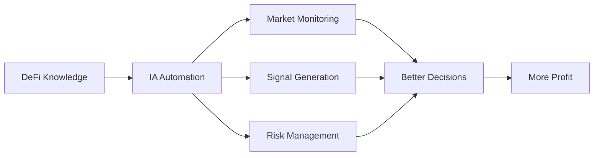

# 🧠 MOC DEFIVERSO MASTER

> **Mapa Central de Conhecimento DeFi + IA para Construção de Fortunas**
>
> *"Transformando conhecimento em resultados financeiros reais através de DeFi + Inteligência Artificial"*

---

## 🎯 VISÃO GERAL

**Mentor:** Lucas Amoedo
**Status Atual:** 4 módulos completos + Operação R$3.000 validada ✅
**Próximo Marco:** Estrutura perfeita → M5-M12 + Automações IA
**Objetivo Final:** Fortunas através de DeFi + IA + Conhecimento Sistemático

**Última Atualização:** {{data_atual}}
**Próxima Revisão:** Diária (mercado cripto)

---

## 📊 DASHBOARD RÁPIDO

### Status de Conhecimento
- [x] **M1 - Blockchain Fundamentos** ✅ Dominado
- [x] **M2 - Ethereum & Altcoins** ✅ Dominado
- [x] **M3 - Ciclos & Timing** ✅ Aplicado (R$3k lucro)
- [x] **M4 - Análise Científica** ✅ Completo
- [ ] **M5 - Portal DeFi** 🔄 Em progresso
- [ ] **M6-M12** ⏳ Pendentes

### Resultados Práticos
- 💰 **Operação Histórica:** R$3.000 lucro real (29/07/2025)
- 📈 **ROI:** 37% gain (BTC $50k → $118k)
- 🎯 **Timing:** Fear & Greed 75 (perfeito)
- 💎 **Capital Atual:** R$9.350 posicionado

### Ferramentas Dominadas
- ✅ Look Into Bitcoin (MVRV, NUPL, Rainbow)
- ✅ Fear & Greed Index
- ✅ TradingView
- ✅ Token Terminal (básico)
- ⏳ Glassnode (avançado)
- ⏳ Automações IA

---

## 🗺️ NAVEGAÇÃO PRINCIPAL

### 📚 [[01_CONHECIMENTO]]
Conceitos fundamentais organizados em atomic notes

#### DeFi/Conceitos_Atomicos/
- [[Blockchain]] - Tecnologia base
- [[Smart_Contracts]] - Contratos inteligentes
- [[DeFi_Protocols]] - Protocolos descentralizados
- [[Layer2_Solutions]] - Escalabilidade
- [[Consensus_Mechanisms]] - Algoritmos de consenso
- [[Tokenomics]] - Economia de tokens
- [[Gas_Optimization]] - Otimização de custos

#### DeFi/Protocolos/
- [[Uniswap]] - DEX líder
- [[Aave]] - Lending/Borrowing
- [[MakerDAO]] - Stablecoins descentralizadas
- [[Arbitrum]] - Layer 2
- [[Optimism]] - Layer 2

#### DeFi/Ferramentas/
- [[Look_Into_Bitcoin]] - Indicadores on-chain
- [[Fear_Greed_Index]] - Sentiment analysis
- [[Glassnode]] - Analytics avançado
- [[TradingView]] - Análise técnica
- [[Etherscan]] - Block explorer

#### DeFi/Estrategias/
- [[Metodo_Barca]] - Sistema Lucas Amoedo
- [[DCA_Avancado]] - Dollar Cost Averaging
- [[Timing_Strategies]] - Ciclos de mercado
- [[Risk_Management]] - Gestão de risco
- [[Contrarian_Mindset]] - Psicologia vencedora

---

### 🚀 [[02_PROJETOS]]

#### DeFi_Verso_2025/Modulos/
- [[M1_Blockchain_Fundamentos]]
- [[M2_Ethereum_Altcoins]]
- [[M3_Ciclos_Timing]]
- [[M4_Analise_Cientifica]]
- [[M5_Portal_DeFi]]
- [[M6_Financas_Descentralizadas]]
- [[M7_Primeiros_Rendimentos]]
- [[M8_Pools_Liquidez]]
- [[M9_Identidade_Cripto]]
- [[M10_Imperio_Metodo_Barca]]
- [[M11_Gestao_Emocional]]
- [[M12_Profundezas_DeFi]]

#### DeFi_Verso_2025/Operacoes/
- [[2025_07_29_Operacao_R3K_Bitcoin]] ⭐ Case histórico
- [[Portfolio_Tracking_Daily]] 📊 Acompanhamento diário
- [[Operations_Journal]] 📓 Diário de operações

#### DeFi_Verso_2025/Automacoes_IA/
- [[IA_Market_Monitor]] 🤖 Monitoramento automatizado
- [[IA_Signal_Generator]] 📡 Gerador de sinais
- [[IA_Risk_Calculator]] ⚠️ Calculadora de risco
- [[IA_Portfolio_Optimizer]] 💼 Otimizador de portfólio
- [[IA_News_Aggregator]] 📰 Agregador de notícias

---

### 📖 [[03_APRENDIZADO]]

#### Cursos/DEFIVERSO_Lucas_Amoedo/
- [[Cronograma_12_Semanas]]
- [[Material_Complementar]]
- [[Lives_Replays]]
- [[Discord_Highlights]]
- [[Notas_Pessoais]]

---

### 📁 [[04_RECURSOS]]

#### DeFi/Material_Original/
- PDFs do curso Lucas Amoedo
- Transcrições de aulas
- Slides e apresentações
- Links e recursos

#### DeFi/Links/
- [[Links_Essenciais_DeFi]]
- [[Ferramentas_OnChain]]
- [[Comunidades_Discord]]
- [[Newsletters_Cripto]]

---

### 💼 [[05_PESSOAL]]

#### Financas/Cripto/Portfolio/
- [[Portfolio_Atual]] 📊 Situação atual
- [[Alocacao_Metodo_Barca]] 🏗️ Estrutura
- [[Performance_Historico]] 📈 Histórico

#### Financas/Cripto/Operacoes/
- [[Operacoes_2025]] 📅 Todas operações do ano
- [[Analise_Performance]] 📊 Análise de resultados
- [[Aprendizados]] 💡 Lições aprendidas

#### Financas/Cripto/Analises/
- [[Analise_Semanal]] 📆 Review semanal
- [[Analise_Mensal]] 📊 Review mensal
- [[Market_Context]] 🌍 Contexto macro

---

## 🔗 CONEXÕES ESTRATÉGICAS

### 🤖 DeFi + IA (Prioridade #1)


**Projetos IA Prioritários:**
1. **Monitor de Mercado 24/7** - Alertas automáticos
2. **Gerador de Sinais** - Timing perfeito baseado em dados
3. **Calculadora de Risco** - Decisões fundamentadas
4. **Otimizador de Portfólio** - Rebalanceamento inteligente
5. **Agregador de Notícias** - Contexto em tempo real

### 🌱 DeFi + Agrofloresta (Futuro)
- [[Tokenizacao_Carbono]]
- [[ReFi_Regenerative_Finance]]
- [[Agricultural_DeFi]]

### ⛪ DeFi + Fé Cristã (Valores)
- [[Stewardship_Digital_Assets]]
- [[Etica_Cripto]]
- [[Biblical_Finance_Principles]]

---

## 📊 SISTEMA DE TAGS

### Tags de Nível
- `#fundamental` - Conceitos base essenciais
- `#intermediario` - Conhecimento aplicado
- `#avancado` - Estratégias complexas
- `#expert` - Insights únicos validados

### Tags de Categoria
- `#blockchain` - Tecnologia base
- `#defi` - Finanças descentralizadas
- `#timing` - Ciclos e mercado
- `#estrategia` - Métodos e sistemas
- `#ferramenta` - Tools e plataformas
- `#ia` - Inteligência artificial
- `#operacao` - Trades e ações reais

### Tags de Status
- `#dominado` - Conhecimento consolidado
- `#em-progresso` - Aprendendo
- `#aplicado` - Usado na prática
- `#validado` - Comprovado com resultados

### Tags de Prioridade
- `#urgente` - Ação imediata
- `#importante` - Atenção prioritária
- `#monitorar` - Acompanhar
- `#futuro` - Para depois

---

## 🎯 WORKFLOWS DIÁRIOS

### 🌅 Rotina Matinal (30 min)
```markdown
1. [ ] Verificar [[Portfolio_Atual]] (5 min)
2. [ ] Ler [[Market_Context]] atualizado (10 min)
3. [ ] Revisar [[IA_Market_Monitor]] alertas (5 min)
4. [ ] Checar [[Fear_Greed_Index]] (2 min)
5. [ ] Atualizar [[Operations_Journal]] (8 min)
```

### 🌆 Rotina Noturna (20 min)
```markdown
1. [ ] Registrar operações do dia (5 min)
2. [ ] Atualizar [[Analise_Semanal]] (5 min)
3. [ ] Revisar próximos módulos (5 min)
4. [ ] Planejar dia seguinte (5 min)
```

### 📅 Rotina Semanal (2h)
```markdown
1. [ ] [[Analise_Semanal]] completa (30 min)
2. [ ] Avançar 1 módulo DEFIVERSO (60 min)
3. [ ] Review portfolio + rebalancing se necessário (20 min)
4. [ ] Atualizar MOCs e conexões (10 min)
```

---

## 🚀 PRÓXIMOS PASSOS

### Imediato (Esta Semana)
- [ ] Completar migração conhecimento existente
- [ ] Criar todos os conceitos atômicos principais
- [ ] Desenvolver primeira automação IA (Market Monitor)
- [ ] Iniciar M5 Portal DeFi

### Curto Prazo (Próximo Mês)
- [ ] Completar M5-M7
- [ ] Implementar 3 automações IA core
- [ ] Primeira operação com IA assistance
- [ ] Portfolio otimizado método Barca

### Médio Prazo (3 Meses)
- [ ] Completar M8-M12
- [ ] Sistema IA completo funcionando
- [ ] 5+ operações validadas
- [ ] Ensinar metodologia (blog/curso)

### Longo Prazo (2025-2026)
- [ ] Próximo ciclo bull preparado
- [ ] Capital scaling significativo
- [ ] Automações IA rentáveis
- [ ] Integração com Agrofloresta/ReFi

---

## 📚 RECURSOS RÁPIDOS

### Links Essenciais
- [Look Into Bitcoin](https://www.lookintobitcoin.com)
- [Fear & Greed Index](https://alternative.me/crypto/fear-and-greed-index/)
- [Glassnode](https://glassnode.com)
- [DeFi Llama](https://defillama.com)
- [Etherscan](https://etherscan.io)

### Comunidades
- Discord DEFIVERSO
- Twitter Crypto
- Reddit r/CryptoCurrency
- Telegram grupos

### Ferramentas IA
- ChatGPT/Claude - Análise e insights
- Python scripts - Automações
- APIs - Dados em tempo real
- Webhooks - Alertas automáticos

---

## 🏆 CONQUISTAS

### Marcos Históricos
- ✅ **29/07/2025:** Operação Lendária R$3.000 lucro
- ✅ **15/08/2025:** Sistema reorganizado (12 → 4 pastas)
- ✅ **24/11/2025:** Segundo Cérebro estrutura perfeita criada

### Conhecimento Validado
- ✅ M1-M4 dominados
- ✅ Timing perfeito executado (BTC $118k)
- ✅ Contrarian mindset comprovado
- ✅ House money strategy validada

---

## 💡 INSIGHTS PERMANENTES

### Mindset Vencedor
> "Teoria sem execução = zero resultados"

> "Timing > Selection"

> "História não se repete, mas rima"

> "Contrarian = profitable"

> "DCA + Timing = combinação letal"

### Lições de R$3k
1. Múltiplos indicadores > indicador único
2. Profit taking parcial > all-or-nothing
3. House money psychology = game changer
4. Euforia massa = oportunidade contrarian
5. Sistemático + smart exit = sucesso

---

## 🔄 MANUTENÇÃO

**Atualização:** Diária (mercado cripto)
**Revisão Profunda:** Semanal
**Reorganização:** Mensal
**Backup:** Automático (OneDrive)

**Responsável:** Gassen + Claude Code + Automações IA

---

## 📞 SUPORTE

**Mentor:** Lucas Amoedo
**Lives:** Segunda, Terça, Quarta (19h)
**Discord:** DEFIVERSO Community
**Email:** suporte.defiverse.com

---

**Status:** 🔥 **ESTRUTURA PERFEITA ATIVA - READY FOR SCALING** 🔥

**Tags:** #moc-master #defiverso #defi #ia #estrutura-perfeita #diario #fortunas

---

*Última atualização automática: {{timestamp}}*
