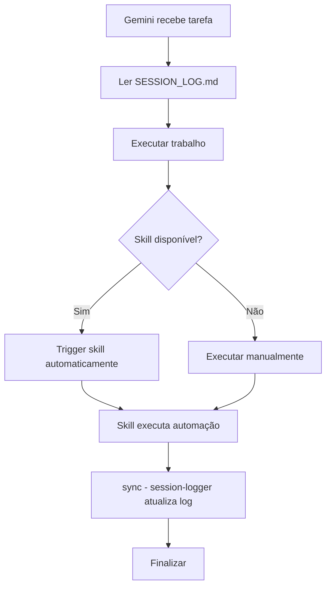

# MOC: Skills Sistema Bi-IA (Claude + Gemini)

**Índice Master das Skills de Automação**

Este MOC documenta todas as skills do sistema bi-IA (Claude Code + Antigravity/Gemini), servindo como guia de navegação, uso e manutenção.

---

## 📊 VISÃO GERAL

### O Que São Skills?

**Skills Claude Code:**
- Slash commands (`.claude/commands/`)
- Conhecimento contextual injetado via prompt
- Claude analisa situação e executa manualmente
- Exemplo: `/sync`, `/validate`, `/marie-kondo`

**Skills Antigravity (Gemini):**
- Automações executáveis (`.gemini/skills/`)
- Scripts Python que rodam diretamente
- Gemini detecta trigger e executa automaticamente
- Exemplo: "sync" → roda `session-logger`

### Sistema Bi-IA

**Agentes:**
- **Claude Code** - Estratégia, arquitetura, decisões críticas
- **Antigravity/Gemini** - Execução, bulk operations, automação

**Comunicação:**
- `SESSION_LOG.md` - Canal bidirecional (lido por ambos)
- `PC_SYNC_LOG.md` - Sincronização multi-PC
- Skills compartilhadas via vault

**Benefícios:**
- ✅ Economia de tokens (Claude delega tarefas massivas)
- ✅ Automação inteligente (Gemini executa sem supervisão)
- ✅ Continuidade (cada agente vê trabalho do outro)
- ✅ Especialização (cada agente no que faz melhor)

---

## 🔵 SKILLS CLAUDE CODE

### Agentes de Plataforma

**1. Claude Architect** (`/claude-architect`)
- **Função:** Guardião de padrões e qualidade
- **Quando usar:** Ao iniciar sessão (ativa automaticamente contexto)
- **Localização:** `.claude/commands/claude-architect.md`
- **Status:** ✅ Ativo

**2. Marie Kondo** (`/marie-kondo`)
- **Função:** Organização de vaults
- **Quando usar:** Limpeza, auditoria, organização
- **Localização:** `.claude/commands/marie-kondo.md`
- **Status:** ✅ Ativo

### Agentes de Domínio

**3. Névoa** (`/nevoa`)
- **Função:** Orquestração e continuidade
- **Quando usar:** Coordenação entre agentes, decisões estratégicas
- **Localização:** `.claude/commands/nevoa.md`
- **Status:** ✅ Ativo

**4. Elena Vasquez** (`/elena`)
- **Função:** Produtividade & TDAH
- **Quando usar:** Gestão de tarefas, foco, organização pessoal
- **Localização:** `.claude/commands/elena.md`
- **Status:** ✅ Ativo

**5. Pedro Sobral** (`/pedro`)
- **Função:** Tráfego Pago & Marketing
- **Quando usar:** Campanhas, copy, análise de métricas
- **Localização:** `.claude/commands/pedro.md`
- **Status:** ✅ Ativo

**6. Alan Nicolas** (`/alan`)
- **Função:** IA & Automação
- **Quando usar:** N8N, apps web, sistema 5C
- **Localização:** `.claude/commands/alan.md`
- **Status:** ✅ Ativo

**7. Lucas Amoedo** (`/lucas`)
- **Função:** DeFi & Cripto
- **Quando usar:** Auditorias, smart contracts, análise on-chain
- **Localização:** `.claude/commands/lucas.md`
- **Status:** ✅ Ativo

**8. Dr. Green** (`/dr-green`)
- **Função:** Cultivo Medicinal
- **Quando usar:** Pesquisa, análise, planejamento cultivo
- **Localização:** `.claude/commands/dr-green.md`
- **Status:** ✅ Ativo

### Ferramentas Essenciais

**9. Validate** (`/validate`)
- **Função:** Validar criação de arquivos antes de criar
- **Quando usar:** SEMPRE antes de criar novos arquivos
- **Localização:** `.claude/commands/validate.md`
- **Status:** ✅ Ativo

**10. Sync** (`/sync`)
- **Função:** Sincronizar com Gemini (atualizar SESSION_LOG.md)
- **Quando usar:** Fim de sessão, antes de delegar para Gemini
- **Localização:** `.claude/commands/sync.md`
- **Status:** ✅ Ativo

**11. Gemini** (`/gemini`)
- **Função:** Delegar para Gemini 3 Pro (1M tokens)
- **Quando usar:** Tarefas massivas, bulk operations
- **Localização:** `.claude/commands/gemini.md`
- **Status:** ✅ Ativo

**12. Ultra Think** (`/ultra-think`)
- **Função:** Análise profunda, problemas complexos
- **Quando usar:** Decisões críticas, multi-dimensional thinking
- **Localização:** `.claude/commands/ultra-think.md`
- **Status:** ✅ Ativo

**13. Mapa** (`/mapa`)
- **Função:** Carregar índice completo do vault (economia tokens)
- **Quando usar:** Navegação rápida, contexto geral
- **Localização:** `.claude/commands/mapa.md`
- **Status:** ✅ Ativo

### Contextos

**14. Learn** (`/learn`)
- **Função:** Ativar contexto de aprendizado
- **Quando usar:** Trabalhar em cursos (03_APRENDIZADO)
- **Localização:** `.claude/commands/learn.md`
- **Status:** ✅ Ativo

**15. Work** (`/work`)
- **Função:** Ativar contexto de projetos
- **Quando usar:** Trabalhar em projetos (02_PROJETOS)
- **Localização:** `.claude/commands/work.md`
- **Status:** ✅ Ativo

### Manutenção

**16. Atualizar Status** (`/atualizar-status`)
- **Função:** Atualizar STATUS_VAULT.md com progresso
- **Quando usar:** Após mudanças estruturais
- **Localização:** `.claude/commands/atualizar-status.md`
- **Status:** ✅ Ativo

**17. Limpeza Raiz Vault** (`/limpeza-raiz-vault`)
- **Função:** Limpar pastas duplicadas da raiz
- **Quando usar:** Arquivos fora do lugar
- **Localização:** `.claude/commands/limpeza-raiz-vault.md`
- **Status:** ✅ Ativo

---

## 🟢 SKILLS ANTIGRAVITY (GEMINI)

### Fase 2: Protótipo (COMPLETO ✅)

**1. Vault Organizer** (`vault-organizer`)
- **Função:** Automação de organização de arquivos
- **Triggers:** "organizar vault", "marie kondo"
- **Implementação:** `.gemini/skills/vault-organizer/`
  - `skill.md` - Metadados + descrição
  - `scripts/organizer.py` - Script Python executável
- **Features:**
  - Move arquivos da raiz para categorias corretas
  - Aplica padrões de nomenclatura
  - Atualiza MOCs
  - Cria relatório de ações
- **Safety:** Cria backup antes de mover, validação de paths
- **Status:** ✅ APROVADA (18/JAN/2026)

**2. Status Updater** (`status-updater`)
- **Função:** Automação de STATUS_VAULT.md
- **Triggers:** "atualizar status", "status vault"
- **Implementação:** `.gemini/skills/status-updater/`
  - `skill.md` - Metadados + descrição
  - `scripts/updater.py` - Lógica principal
  - `scripts/metrics.py` - Coleta de métricas
- **Features:**
  - Coleta 15+ métricas do vault
  - Calcula progresso de fases (heurísticas inteligentes)
  - Atualiza STATUS_VAULT.md com regex (preserva formatação)
  - Adiciona entrada no histórico
  - Barra de progresso visual (█████)
- **Safety:** Backup automático, não sobrescreve overview manual
- **Status:** ✅ APROVADA (18/JAN/2026)

**3. Session Logger** (`session-logger`)
- **Função:** Automação de SESSION_LOG.md (comunicação bi-IA)
- **Triggers:** "sync", "atualizar session log", "registrar sessão"
- **Implementação:** `.gemini/skills/session-logger/`
  - `skill.md` - Metadados + descrição
  - `scripts/logger.py` - Script principal
  - `scripts/__init__.py` - Módulo Python
- **Features:**
  - Detecta mudanças via git status
  - Identifica agente ativo (Claude/Gemini)
  - Categoriza ações (Skills, KabaK, Sistema, etc.)
  - Gera entrada markdown com template bi-IA
  - Emojis: 🟣 Gemini / 🔵 Claude
  - Insere no topo de SESSION_LOG.md
  - Título automático baseado em categoria dominante
- **Safety:** Backup automático, encoding UTF-8, modo dry-run
- **Status:** ✅ APROVADA (18/JAN/2026)

### Fase 4: Conversão Top 7 (PLANEJADO ⏳)

**4. Gemini Delegator** (futuro)
- **Função:** Automação de delegação Claude → Gemini
- **Triggers:** "delegar para gemini"
- **Status:** ⏳ Planejado (Fase 4)

**5. Ultra Think** (futuro)
- **Função:** Análise profunda automatizada
- **Triggers:** "ultra think", "análise profunda"
- **Status:** ⏳ Planejado (Fase 4)

**6. Validate** (futuro)
- **Função:** Validação automática de estrutura de arquivos
- **Triggers:** "validar arquivo", "check nomenclatura"
- **Status:** ⏳ Planejado (Fase 4)

**7. Coach TDAH** (futuro)
- **Função:** Automação de workflows produtividade
- **Triggers:** "coach", "foco", "tdah"
- **Status:** ⏳ Planejado (Fase 4)

---

## 🔄 WORKFLOW DE USO

### Cenário 1: Claude Inicia Sessão

```mermaid
graph TD
    A[Claude abre sessão] --> B[Ler SESSION_LOG.md]
    B --> C{Gemini deixou trabalho?}
    C -->|Sim| D[Revisar mudanças]
    C -->|Não| E[Continuar trabalho normal]
    D --> F[Decidir: continuar ou novo trabalho]
    F --> G[Executar tarefas]
    G --> H[/sync - Atualizar SESSION_LOG.md]
    H --> I{Delegar para Gemini?}
    I -->|Sim| J[/gemini - Criar prompt]
    I -->|Não| K[Finalizar sessão]
```

### Cenário 2: Gemini Executa Tarefa



### Cenário 3: Organização de Vault

```mermaid
graph TD
    A[Usuário: "Organizar vault"] --> B{Qual agente?}
    B -->|Claude| C[/marie-kondo]
    B -->|Gemini| D["organizar vault" trigger]
    C --> E[Claude analisa e organiza]
    D --> F[vault-organizer executa]
    E --> G[/sync - registrar]
    F --> H["sync" - registrar automaticamente]
```

---

## 📋 PROTOCOLOS DE COMUNICAÇÃO

### 1. SESSION_LOG.md

**Estrutura:**
```markdown
## 🟣 Antigravity (Gemini 3 Pro) - DD/MMM/YYYY (HH:MM) - TÍTULO

### Trabalho Realizado

**Categoria 1**
* ✅ Ação 1
* ✅ Ação 2

### Arquivos Criados/Modificados

* `caminho/arquivo.md` - Descrição

### Mensagem para Claude Code

> Mensagem ou "Nenhuma ação necessária"

---
```

**Template Claude:**
```markdown
## 🔵 Claude Code - DD/MMM/YYYY (HH:MM) - TÍTULO

[Mesmo formato]
```

**Protocolo:**
1. ✅ Sempre ler ao iniciar sessão
2. ✅ Atualizar ao finalizar (skill ou manual)
3. ✅ Inserir no topo
4. ✅ Preservar últimas 20 entradas
5. ✅ Criar backup antes de atualizar

### 2. Delegação Claude → Gemini

**Via `/gemini` skill:**
1. Claude identifica tarefa massiva
2. Cria prompt detalhado (PROMPT_Gemini_*.md)
3. Registra em SESSION_LOG.md
4. Gemini lê e executa
5. Gemini registra conclusão

**Exemplo:**
```markdown
PROMPT_Gemini_Criar_Skill_X.md

## CONTEXTO
[Explicação completa]

## OBJETIVO
[O que fazer]

## ESPECIFICAÇÕES
[Detalhes técnicos]

## VALIDAÇÃO
[Checklist]
```

### 3. Skills Antigravity

**Ativação:**
- Linguagem natural (trigger words)
- Gemini detecta e executa automaticamente
- Não precisa de comando explícito

**Exemplo:**
```
Usuário: "Sync"
Gemini: [Detecta trigger "sync"]
        [Executa session-logger automaticamente]
        [Atualiza SESSION_LOG.md]
        [Mostra confirmação]
```

---

## 📍 LOCALIZAÇÃO DOS ARQUIVOS

### Skills Claude Code
```
.claude/
├── commands/           # Todas as skills Claude
│   ├── claude-architect.md
│   ├── marie-konde.md
│   ├── nevoa.md
│   ├── elena.md
│   ├── pedro.md
│   ├── alan.md
│   ├── lucas.md
│   ├── dr-green.md
│   ├── validate.md
│   ├── sync.md
│   ├── gemini.md
│   ├── ultra-think.md
│   ├── mapa.md
│   ├── learn.md
│   ├── work.md
│   ├── atualizar-status.md
│   └── limpeza-raiz-vault.md
```

### Skills Antigravity
```
.gemini/
├── skills/             # Todas as skills Antigravity
│   ├── vault-organizer/
│   │   ├── skill.md
│   │   └── scripts/
│   │       └── organizer.py
│   ├── status-updater/
│   │   ├── skill.md
│   │   └── scripts/
│   │       ├── updater.py
│   │       └── metrics.py
│   └── session-logger/
│       ├── skill.md
│       └── scripts/
│           ├── logger.py
│           └── __init__.py
```

### Logs de Comunicação
```
/ (raiz do vault)
├── SESSION_LOG.md      # Comunicação Claude ↔ Gemini
└── PC_SYNC_LOG.md      # Sincronização multi-PC
```

---

## 🗺️ ROADMAP

### ✅ Fase 1: Fundação (COMPLETO)
- ✅ Estrutura base do vault
- ✅ Padrões e protocolos
- ✅ Skills Claude Code (17 skills)
- ✅ Pesquisa Antigravity Skills

### ✅ Fase 2: Prototipação (COMPLETO)
- ✅ Skill #1: vault-organizer (APROVADA)
- ✅ Skill #2: status-updater (APROVADA)
- ✅ Skill #3: session-logger (APROVADA)
- ✅ Validação completa
- ✅ MOC_Skills_BiIA.md criado

### ⏳ Fase 3: Protocolos (PRÓXIMO)
- [ ] Protocolo de uso das skills
- [ ] Guia de troubleshooting
- [ ] Documentação de edge cases
- [ ] Templates de prompts para skills futuras

### ⏳ Fase 4: Conversão Top 7
- [ ] Skill #4: gemini-delegator
- [ ] Skill #5: ultra-think
- [ ] Skill #6: validate
- [ ] Skill #7: coach-tdah

### ⏳ Fase 5: Monitoramento
- [ ] Métricas de uso
- [ ] Logs de execução
- [ ] Performance tracking
- [ ] Otimizações

---

## 🔗 REFERÊNCIAS

### Documentação
- [[00_SISTEMA/PROTOCOLOS/PROTOCOLO_SINCRONIZACAO_AGENTES.md]] - Protocolo bi-IA completo
- [[00_SISTEMA/PROTOCOLOS/PROTOCOLO_DIVISAO_SKILLS_Claude_Antigravity.md]] - Divisão de responsabilidades
- [[SESSION_LOG.md]] - Canal de comunicação ativo
- [[00_SISTEMA/CHECKPOINTS/CHECKPOINT_18JAN2026_Antigravity_Skills_Integration.md]] - Checkpoint inicial
- [[CHECKPOINT_18JAN2026_Skills_1_2_Validadas.md]] - Checkpoint Fase 2

### Skills Individuais
- `.gemini/skills/vault-organizer/skill.md`
- `.gemini/skills/status-updater/skill.md`
- `.gemini/skills/session-logger/skill.md`

### Prompts de Criação
- [[PROMPT_Gemini_Criar_Status_Updater_Skill.md]]
- [[PROMPT_Gemini_Criar_Session_Logger_Skill.md]]

---

## 📊 ESTATÍSTICAS

**Skills Totais:** 20
- Claude Code: 17 skills ✅
- Antigravity: 3 skills ✅ + 4 planejadas ⏳

**Linhas de Código:**
- vault-organizer: ~350 linhas Python
- status-updater: ~400 linhas Python (2 scripts)
- session-logger: ~350 linhas Python

**Triggers Totais:** 14 (Antigravity)
- vault-organizer: 2 triggers
- status-updater: 2 triggers
- session-logger: 5 triggers

**Categorias Detectadas (session-logger):**
- Desenvolvimento de Skills (Claude/Antigravity)
- Manutenção do Sistema
- Gestão de Conhecimento
- Execução de Projetos (KabaK específico)
- Aprendizado
- Outros

---

## ✅ CHECKLIST DE USO

### Ao Iniciar Sessão (Claude)
- [ ] Ler SESSION_LOG.md completamente
- [ ] Verificar "Mensagem para Claude Code"
- [ ] Verificar última mudança (Gemini fez algo?)
- [ ] Decidir: continuar trabalho Gemini ou iniciar novo

### Ao Finalizar Sessão (Claude)
- [ ] Executar `/sync` (atualizar SESSION_LOG.md)
- [ ] Se delegando para Gemini: criar PROMPT_Gemini_*.md
- [ ] Verificar STATUS_VAULT.md está atualizado
- [ ] Commit + push se necessário

### Ao Executar Tarefa (Gemini)
- [ ] Ler SESSION_LOG.md (contexto)
- [ ] Executar trabalho
- [ ] Trigger "sync" ao finalizar (session-logger automático)
- [ ] Verificar entrada criada em SESSION_LOG.md

### Ao Criar Nova Skill (Gemini)
- [ ] Ler PROMPT_Gemini_*.md completo
- [ ] Criar estrutura (skill.md + scripts/)
- [ ] Implementar funcionalidades
- [ ] Testar em nova conversa
- [ ] Atualizar SESSION_LOG.md
- [ ] Avisar Claude para validação

### Ao Validar Skill (Claude)
- [ ] Ler skill.md (metadados, descrição, triggers)
- [ ] Ler scripts/*.py (implementação)
- [ ] Verificar conformidade com especificações
- [ ] Testar (se possível)
- [ ] APROVAR ou SUGERIR correções
- [ ] Atualizar este MOC
- [ ] Atualizar STATUS_VAULT.md

---

## 🎯 PRINCÍPIOS DO SISTEMA

### 1. Especialização
- Claude: Estratégia, arquitetura, decisões críticas
- Gemini: Execução, bulk operations, automação

### 2. Comunicação Clara
- SESSION_LOG.md é fonte única da verdade
- Sempre atualizar ao finalizar
- Sempre ler ao iniciar
- Mensagens explícitas quando necessário

### 3. Automação Inteligente
- Skills executam apenas quando solicitadas (triggers)
- Backup automático antes de modificar
- Preview antes de confirmar (quando possível)
- Modo dry-run para testes

### 4. Manutenibilidade
- Código documentado
- Estrutura padronizada
- Versionamento claro
- Changelog em SESSION_LOG.md

### 5. Segurança
- Backup antes de modificar
- Validação de paths
- Encoding UTF-8 (Windows-friendly)
- Error handling robusto

---

**Versão:** 1.0
**Criado:** 18/JAN/2026
**Atualizado:** 18/JAN/2026
**Status:** ✅ ATIVO
**Próxima revisão:** Após Fase 3 (Protocolos)

---

**Este MOC é o índice central do sistema bi-IA. Manter atualizado sempre que novas skills forem criadas ou protocolos modificados.**
