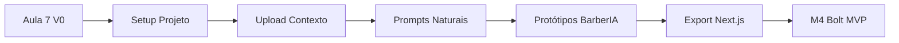

# 🛠️ V0 TOOL - CONHECIMENTO APLICADO AO BARBERIA PRO

---

**AULA:** 7 - Conhecendo o V0  
**CURSO:** Aplicativos Web com IA  
**PROCESSADO:** 17/08/2025  
**APLICAÇÃO:** M3 V0 Protótipos BarberIA Pro

---

## 📚 **CONHECIMENTO EXTRAÍDO - AULA 7**

### **🎯 CONCEITOS FUNDAMENTAIS V0**

#### **O QUE É V0:**

- Ferramenta de geração de interfaces por **Vercel**
- Focada em **React/Next.js** ecosystem
- Ainda **pouco utilizada** = vantagem competitiva
- **IA-powered** interface generator

#### **ACESSO E AUTENTICAÇÃO:**

- Login via **GitHub** (não Google)
- Voltado para **desenvolvedores**
- Integração direta com **Vercel deploy**
- Teams/billing para **colaboração**

#### **INTERFACE PRINCIPAL:**

1. **Sidebar Expansível:**
   - Toggle para maximizar área trabalho
   - Notícias/atualizações Vercel

2. **New Chat:**
   - Similar ChatGPT para desenvolvimento
   - Prompts em linguagem natural
   - Geração instantânea código

3. **Library:**
   - Histórico completo prompts/códigos
   - Versionamento automático
   - Organização por chat/projeto

4. **Blocks:**
   - Visualização detalhada projetos
   - Preview múltiplas telas
   - Comparação versões

## 🔧 **ESPECIFICAÇÕES TÉCNICAS**

### **STACK OBRIGATÓRIA:**

```javascript
// V0 otimizado APENAS para:
- Next.js (app-router)
- React Components
- Tailwind CSS
- ShadeCN UI

// Performance ruim com:
- Vue, Angular, Svelte
- Vanilla JS
- Bootstrap, Material UI
```

### **RECURSOS PROJETO:**

#### **1. Sources (Documentação):**

- Upload **guias de estilo**
- **Identidade visual** marca
- **Documentação** técnica
- V0 **adapta designs** baseado contexto

#### **2. Environment Variables:**

```env
OPENAI_API_KEY=sk-...
WHATSAPP_API_KEY=...
SUPABASE_URL=...
STRIPE_SECRET_KEY=...
```

#### **3. Configurações:**

- **Theme:** Light/Dark/System
- **Language:** Português suportado
- **Figma:** Integração (paid only)
- **Teams:** Múltiplos projetos

## 🚀 **APLICAÇÃO BARBERIA PRO**

### **M3 V0 - ESTRATÉGIA PROTÓTIPOS**

#### **1. PREPARAÇÃO PROJETO V0:**

```markdown
NOME PROJETO: BarberIA Pro - MicroSaaS
INSTRUÇÕES:

- Mobile-first para barbearias Brasil
- WhatsApp como canal principal
- Glassmorphism + gradientes azul/verde
- IA generativa visível interface
- Gamificação elementos visuais

SOURCES UPLOAD:

- Logo BarberIA Pro
- Paleta cores (azul profissional + verde WhatsApp)
- Screenshots concorrentes (para diferenciação)
- Fluxograma jornada cliente
```

#### **2. PROTÓTIPOS PLANEJADOS:**

##### **A. Dashboard Barbeiro (Mobile):**

```typescript
// Prompt V0:
"Crie um dashboard mobile-first para barbeiro com:
- Header glassmorphism com logo e notificações
- Cards KPIs: agendamentos hoje, faturamento, taxa ocupação
- Lista próximos clientes com foto WhatsApp
- Botão flutuante '+' novo agendamento
- Bottom navigation: Home, Agenda, Clientes, Finanças, Config
- Cores: azul profissional gradiente
- Micro-animações sutis entrada"
```

##### **B. Interface Cliente WhatsApp:**

```typescript
// Prompt V0:
"Crie interface chat WhatsApp para agendamento:
- Header verde WhatsApp native
- Bubbles conversa: bot esquerda, cliente direita
- Quick replies: horários disponíveis cards
- Carousel serviços com preços
- Confirmação visual agendamento
- Integração PIX QR code
- Typing indicator animado"
```

##### **C. Admin Analytics IA:**

```typescript
// Prompt V0:
"Crie dashboard analytics com IA insights:
- Gráficos Chart.js interativos
- Cards predições: melhor horário, serviço trending
- Heatmap ocupação semanal
- Insights IA em cards amarelos destaque
- Filtros período responsivos
- Export PDF relatório"
```

## 📊 **VANTAGENS V0 PARA BARBERIA PRO**

### **ECONOMIA TEMPO:**

- **80% faster** desenvolvimento interfaces
- Código **production-ready** exportável
- **Zero** setup inicial complexo
- Iteração **instantânea** com prompts

### **QUALIDADE CÓDIGO:**

- **Best practices** React/Next.js
- **Acessibilidade** incluída
- **SEO** otimizado
- **Performance** lighthouse green

### **DIFERENCIAL COMPETITIVO:**

- Protótipos **únicos** vs templates
- **IA adapta** identidade visual
- **Mobile-first** nativo
- **Iteração rápida** com cliente

## 🎯 **ROADMAP IMPLEMENTAÇÃO V0**

### **FASE 1 - SETUP (1 dia):**

- [ ] Criar conta V0 com GitHub
- [ ] Criar projeto "BarberIA Pro"
- [ ] Upload identidade visual
- [ ] Configurar env variables

### **FASE 2 - PROTÓTIPOS (3 dias):**

- [ ] Dashboard Barbeiro v1
- [ ] Interface Cliente WhatsApp
- [ ] Admin Analytics básico
- [ ] Landing page conversão

### **FASE 3 - REFINAMENTO (2 dias):**

- [ ] Feedback iteração prompts
- [ ] Ajustes UX/UI específicos
- [ ] Responsividade completa
- [ ] Micro-animações polish

### **FASE 4 - EXPORT (1 dia):**

- [ ] Export código Next.js
- [ ] Setup projeto local
- [ ] Integração Supabase
- [ ] Deploy Vercel preview

## 💡 **INSIGHTS ESTRATÉGICOS**

### **DO's ✅:**

- Usar **linguagem natural** detalhada
- Fornecer **contexto visual** (upload docs)
- Iterar **incrementalmente**
- Manter **Library organizada**
- Versionar **Blocks** importantes

### **DON'Ts ❌:**

- Tentar forçar **Vue/Angular**
- Pular **documentação contexto**
- Fazer **tudo em um prompt**
- Ignorar **feedback V0**
- Esquecer **mobile-first**

## 🔄 **INTEGRAÇÃO CURSO**

### **SÍNTESE APRENDIZADO:**



### **CONEXÃO AULAS:**

- **Aula 3:** Artifacts visuais ✅
- **Aula 4:** Interfaces interativas ✅
- **Aula 5:** Dashboard KPIs ✅
- **Aula 7:** V0 Tool completo ✅
- **Próximo:** Aplicação prática V0

## 📝 **PRÓXIMOS PASSOS**

### **IMEDIATO:**

1. **Processar** mais aulas V0 avançadas
2. **Criar conta** V0 com GitHub
3. **Preparar** assets visuais BarberIA Pro

### **CURTO PRAZO:**

1. **Gerar** primeiro protótipo Dashboard
2. **Iterar** com feedback V0
3. **Documentar** processo aprendizado

### **MÉDIO PRAZO:**

1. **Completar** suite protótipos
2. **Exportar** código produção
3. **Iniciar** M4 Bolt desenvolvimento

---

## ✅ **CHECKPOINT V0 KNOWLEDGE**

**CONCEITOS DOMINADOS:**

- [x] Interface V0 compreendida
- [x] Stack técnica identificada
- [x] Workflow desenvolvimento mapeado
- [x] Integração BarberIA planejada

**FERRAMENTAS PRONTAS:**

- [x] Prompts estruturados
- [x] Assets identificados
- [x] Roadmap definido
- [x] Estratégia clara

**STATUS:** Pronto para aplicação prática V0 no BarberIA Pro

---

_"V0: De prompt para produção em minutos, não meses."_
